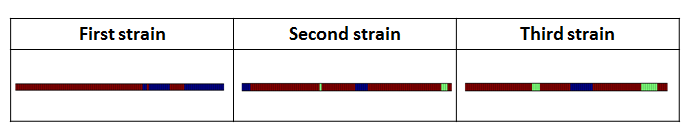
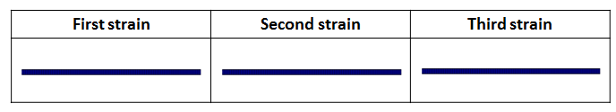

.. _dynamics:

Dynamics of AS Patterns
=======================

Introduction
------------

The objective of Dynamics Analysis is to analyze and characterize the state transforming behaviors of different strains of mice. The analysis is mainly focused on the three strains of mice included in the interval dataset. Using a Markov Chain Model, a sequence of state transition probability matrix is retrieved for each strain depending on the time intervals. A simulation mouse is then generated based on the model and an evaluated. The evaluation system is created using the time interval that produces the most realistic simulation mouse. Further visualization of the fake mice is done to explore the discrepancy between different strain's behaviors. 

Data Source
-----------

We are using data from intervals directory for estimating the dynamics pattern.

Methodology
-----------

1. Defining states of interest:

- Feeding: labeled by event F
- Drinking: labeled by event W
- Other active state behaviors: This could possibly include all other movements in the AS state of a mouse besides drinking and eating.
- Inactive State: labeled by event I.

2. Data Preprocessing:

We first transform data from intervals directory to a time matrix. The rows of the matrix indicate a specific strain, specific mouse and specific day. The columns of the matrix represent the 24 hours in a day. The content of the matrix indicates the state of a specific strain, specific mouse and specific day in the column time. Here we define 0 as IS, 1 as F, 2 as W, and 3 as Others. Note that there are two important preprocessing methods we do to create such matrix:

-  Combining small intervals: Some of the intervals, especially drinking behavior intervals are significantly small, say 0.001 from the beginning to the end for an interval, which does not make sense. So we combined these intervals if the next interval start time minus the last interval stop time is smaller than a threshold. We are using 4 seconds as the default threshold. 
-  Choosing the gap between columns: After combining small intervals, all the current behavior intervals are at least 4 seconds long. Now we want to set a gap between columns so that we can divide 24 hours equally and map the small columns time into the behavior intervals to determine the state at that column time. We are using 1 second as the default gap.

To create this matrix, one can do::

    from mousestyles.dynamics import create_time_matrix
    data_df = create_time_matrix()

Or, simply import the matrix from data directory::

    from mousestyles.data import load_time_matrix_dynamics
    data_df = load_time_matrix_dynamics()

3. Estimating Transition Probability: 

Estimate the transition probability matrix of the Markov Chain using the data given. One of the key challenges to estimate the transition matrix is that the model used is actually time continuous non-homogeneous Markov Chain, and the parameters are too difficult to estimate given the current data. Therefore, a new way is discovered to make the model a composite of small homogeneous discrete time Markov Chains, so that performing a rough estimation of the original time continuous non-homogeneous Markov Chain is possible. The following steps are followed to get the transistion probability matrix: 

- Divide each mouse day into small time intervals, say 5 minutes. (The time interval is optimized in the future analysis)
- For each of the small time intervals, aggregate the data from all mice in the same strain for all mouse days and estimate the transition probability matrix of a discrete homogeneous Markov Chain model just for this small time interval.
- each of these transition probability matrices is estimated by MLE method, where e.g.: 
   .. math:: P(F_{t+1} | W_{t}) = \frac{N_{WF}}{N_{W.}}
   where $N_{WF}$ indicates the counts of transitions from W to F and $N_{W.}$ indicates the counts of transitions starting from W, no matter where it ends.
- Build the whole model by compositing the models for each small time intervals. 

::

    strain_df = data_df[data_df.strain == 2]
    get_prob_matrix_list(time_df=strain_df,interval_length=1000)
    # [array([[ 1.,  0.,  0.,  0.],
            [ 0.,  0.,  0.,  0.],
            [ 0.,  0.,  0.,  0.],
            [ 0.,  0.,  0.,  0.]]),
    # array([[  9.99854291e-01,   0.00000000e+00,   4.85696246e-05,
               9.71392491e-05],
            [  0.00000000e+00,   9.10714286e-01,   0.00000000e+00,
               8.92857143e-02],
            [  0.00000000e+00,   0.00000000e+00,   5.00000000e-01,
               5.00000000e-01],
            [  0.00000000e+00,   1.64835165e-02,   0.00000000e+00,
               9.83516484e-01]]),
      ...
      ...

4. Simluation: 

Use the Transition Model generated to simluate a typical mouse day for a typical strain. The simulation is time sensitive which means the simulation mouse is generated depending on the time interval chosen in the transition model. The time interval length is optimized in the future analysis so as the generate the best fake mouse for each strain. 

::

    trans_matrix = get_prob_matrix_list(time_df=strain_df,interval_length=1000)
    mcmc_simulation(trans_matrix, n_per_int=1000)
    # array([0, 0, 0, ..., 0, 0, 0])

5. Evaluation System:

How to get a score for the performance of our simulation?
The evaluation system is trying to create a score to evaluate the performance of the simulation. Higher the score, better
the simulation is doing in catching the pattern in the mouse day. Because we have unbalanced data, meaning most of the
statuses in one typical mouse day are IS and OTHERS and only a few of them are DRINK and EAT, we should give more weights on
correct predictions about DRINK and EAT. We first calculate the proportion of the four status within different days we have
for different mice from different strains and then take average to get the ratio of different status. And then we choose the
initial weights based on the numbers we get. For example, a mouse day has 21200 timestamps on average. And on average 10000
of them are IS, 1000 are EAT, 200 are DRINK, and the left 10000 are OTHERS. The ratio is 10000:1000:200:10000 = 1:0.1:0.02:
0.1. Thus, the weights should be the inverse, 1:10:50:1. 

But of course, users can define their own initial weights to fit in their purpose. If the user prefers equal weights, he/she
can simply set the weight to be (1,1,1,1).

The final score is calculated as the number of correct predictions times the weights divided by the number of status. For
example, if our observed data is “IS IS DRK DRK EAT OTHERS”, and our predicted value based on it is “IS IS IS DRK EAT
OTHERS”, the score would be (1+1+0+50+10+1)/6 = 10.5. But because our data contains a lot more IS and OTHERS, the score
ranges from 0 to 1 for our data.

6. Comparison:

The comparison function plots the simulated behavior dynamics obtained from the evaluation function for the given strain during the given time period. 

The x-axis is the time range, and the default time range is from 36,000 to 36,100. It is because the behavior dynamics show clear differences across the strains during this time range and because the behavior dynamics have more active actions than the other time period. Users can, of course, define the time range of their interest. But they should be aware of the lower and upper bounds of the time range before doing comparisons. For the first strain (strain_num = 0), the time range should be between 1 and 92,400. For the second one (strain_num = 1), it should be between 1 and 90,000. The time range should be between 1 and 88,800 for the last strain (strain_num = 2). 

Of note is that, based on our understanding and explanations from the research team, 1 indicates the time when a mouse wakes up and starts its day. The unit of time is understood as one second. Thus, the default time range (from 36,000 to 36,100) represents around 10 hours after the start of the day. Based on this definition of the time range, users can change it and compare simulated behavior dynamics across the three strains.     

We do not define the y-axis for this comparison function, because our interest is to visually understand the dynamics of the four states during the given time period. For better understanding of the behavior dynamics, we assign different colors for different states. In the plot, blue represents IS, bright green represents eating, yellow represents drinking, and red represents other activities in AS.

Result
------

The problem we are insterested in here is whether the three strains of mice are indeed acting differently in a time series manner. The behaviors are compared using the three simulation mice, each for one strain. Therefore, as the first step, the optimal time interval is selected so as to have the most-real simulation mouse that behaves the most similarly to its strain, which is evaluated using the score system we created. As a result, the best time interval length is selected for each strain as well as the corresponding simulation mice behavior and the comparison score.

::

    find_best_interval(data_df,strain=0)
    # (600, array([0, 0, 0, ..., 0, 0, 0]), 0.70509736459572225)
    find_best_interval(data_df,strain=1)
    # (600, array([0, 0, 0, ..., 0, 0, 0]), 0.91423472578532516)
    find_best_interval(data_df,strain=2)
    # (1800, array([0, 0, 0, ..., 0, 0, 0]), 0.83975976073161329)

As the script suggested, the best time interval selected is 600 seconds for the first strain. This generates a simulation mouse that is 71% similar to the real mice in that strain. Note that the simulation behavior is quoted in the numpy array format. Similarly, it shows the 600s optimal time interval with 91% similarity for the second strain and the 1800s optimal time interval with 84% similarity for the third strain. 

With the resulting best simulation mice, we move forward to compare the between-strain behaviors using visulization. The simulated mice show different behavior dynamics across the strains, during the given time period (36,000 to 36,100; around 10 hours after the start of the day). The fake mouse from the first strain does the other active actions and stays inactive for a short period of time. The fake mice from the other two strains, on the other hand, show different dynamic patterns: do the other active actions, consume food, and stay inactive. The fake mice from the third strain consumes food for the longer time for the given time period.

 
However, if we let the plot time range from 1 to 100, all of the three types of fake mice stay inactive. It is intuitive under the daily lives of humans. They are likely to stay home and rest right after getting up. Users can change the plot time range and compare the three mice, which helps understand any differences among the three strains over time.  

Users can also follow the example codes inside at mousestyles/doc/sources/report/plots - plot_dynamics0.py, plot_dynamics1.py, and plot_dynamics2.py - for more details.  
  
  
::

   from mousestyles.data import load_time_matrix_dynamics
   from mousestyles.visualization.dynamics import plot_dynamics
   time_matrix = load_time_matrix_dynamics()
   plot_dynamics(time_matrix, 0) 

Discussion
-----------
We have written the functions and tried understanding dynamic behaviors of mice. There are three issues for further analysis. First, we can apply more statistical approach to detect the discrepancy of behaviors across the strains. Second, larger sample size of mice and longer time period can help understand behavior dynamics more accurately. Third, the inactive states and the other active states can be specified, which can help detect more detailed dynamics of mice behaviors.

References Reading
-------------------

http://scikit-learn.sourceforge.net/stable/modules/hmm.html

https://github.com/hmmlearn/hmmlearn

https://en.wikipedia.org/wiki/Hidden\_Markov\_model

Contribution
------------

- Data Preprocessing: Hongfei
- Modeling: Jianglong
- Simlation: Chenyu
- Score: Weiyan
- Evaluation: Luyun Zhao
- Comparison: Mingyung
