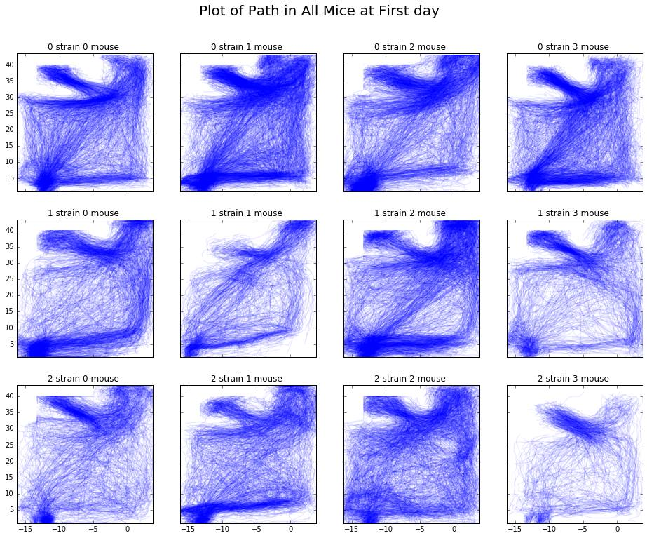
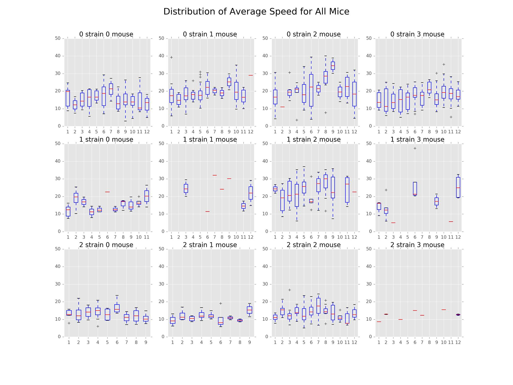
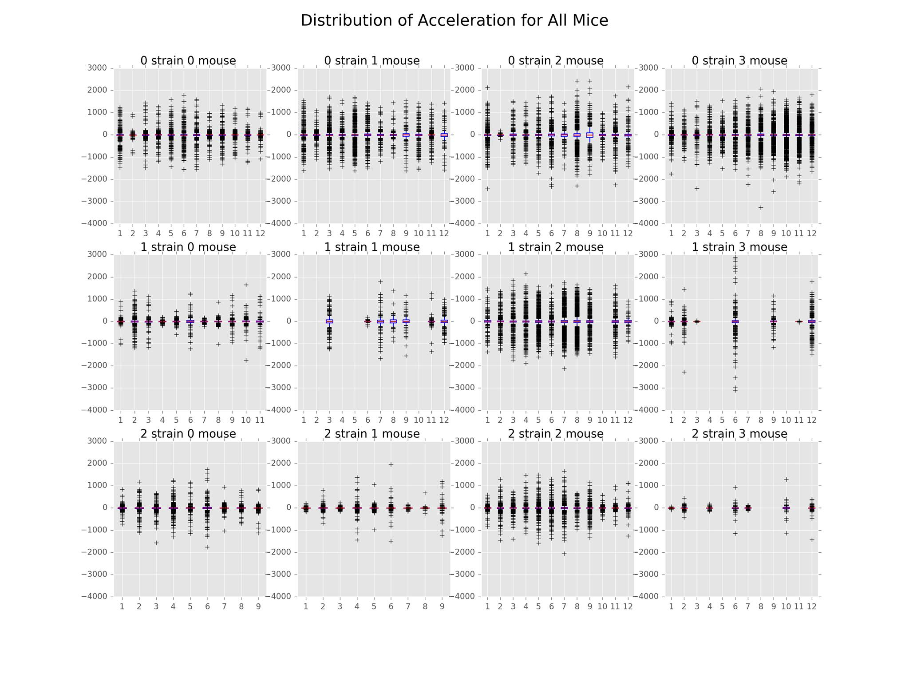
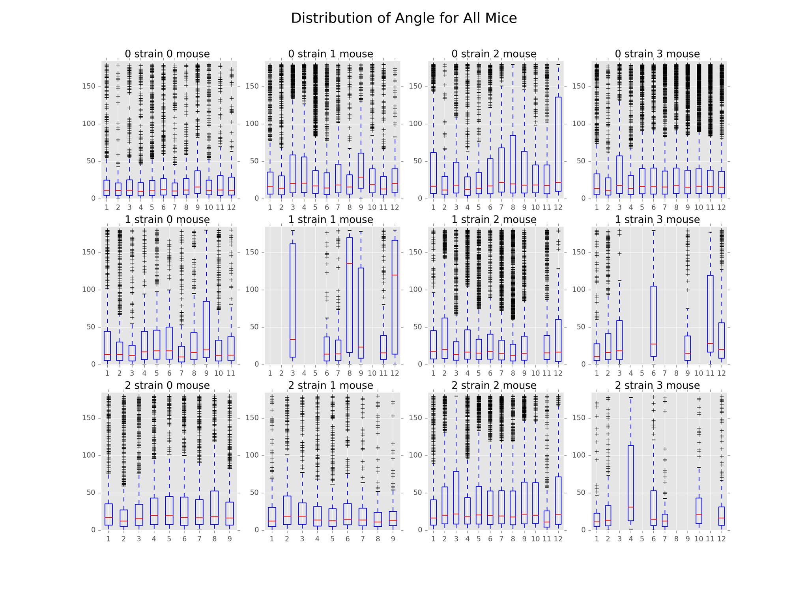

.. _path:

Exploration & Path Diversity
============================

Statement of Problem
--------------------

The movements of mice are theorized to be correlated with physical, neural,
and environmental attributes associated with mice such as strain, health,
time-of-day, and day-of-week. The aim of this subproject was to discover
whether or not mouse locomotion patterns are unique to each strain. To achieve
this objective, we studied the paths the mice took throughout the days of the
experiment. This involved engineering path features such as length, speed,
acceleration, and angle, followed by incorporating visualization techniques to
discover previously hidden patterns.

.. figure:: figure/movement_density.png

   A heatmap of a mouse movement.

Statement of Statistical Problems
---------------------------------

As stated previously, this subproject attempted to discover differences in
path patterns that were unique to each mouse strain and each mouse within a
strain. The major statistical problem associated with this project was to
collapse the data in such a way as to increase our understanding of physical
and psychological behavior through visualization of mouse paths. With the
Tecott lab's visualization graphics as a launching point (see the image
below), we continued on to create features that could be adapted to their
plots and also generated new plotting methods to find the optimal method of
expression. These features might prove useful in the classification
subproject and potentially help us understand the relationship between
behavior and genetics in mice and humans.

.. figure:: figure/mice_path.png
   :alt: alt tag

   Path (image courtesy of Tecott Lab)

Exploratory Analysis
--------------------

The initial exploratory data analysis focused on how to define a path, how to
generate metrics from the data, and how to visualize paths at different points
in the day. Based on advice from the Tecott lab and our initial data
exploration, we separated paths by interruptions in movement that were more
than one second long. The path metrics we chose to include were length, speed,
acceleration, angles, radius, center angles, area covered, area of the
rectangle that contains the path, and absolute distance between the first and
last points of a path. With the results of these features, we hoped to gain a
better understanding of the more granular differences in paths between strains
than with just visualization alone. Having considered these questions, we also
realized the need for data cleaning functions to filter out any noise from the
data.

The figure below is an example of a day in the life of a mouse in terms of
path movements. We see high density movement near the home base, food, and
water locations of the cage.

Data Requirements
-----------------

The data required to perform our analysis included the ``<x, y, t>``
coordinates for the mice as well as a boolean indicating whether the mouse
was situated in its home base. Additionally, we required the daily coordinates
of the home base for each mouse.

Methodology/Approach Description
--------------------------------

**Step 1** : Define “Path”

We define a path based on a specific time threshold between movements. In more
detail, we created a function that considers that time difference. If the time
between movements exceeded the threshold, we considered a new path to have
begun. That path was considered to have ended once the threshold had been
exceeded again. Based on the advice of the Tecott lab, the default threshold
was one second.

**Step 2**: Clean Data

Based on our definition of a path, we realized that we needed to clean the
data to remove obvious outliers and noise. For instance, we found that the
sensor platform generated extreme outliers such as an acceleration of -4000
centimeters per second. In order to remove this noise, we created two
functions: one to filter the paths and one to remove duplicate rows. The
filter paths function uses a minimum number of points in a path to filter out
paths that create noise. For example, a path that is only three points could
simply be a mouse shifting weight from one foot to the other and back again.
Since this is not the type of path we are interested in analyzing, it makes
sense to filter them out. The remove duplicates function deals with an issue
in the data where the same x and y coordinates appear in adjacent rows but
with different timestamps. This caused a problem when computing the angles of
the paths so, while it is a trivial removal, it is necessary.

**Step 3**: Choose Key Features

The path features we wrapped up into functions are as follows:

-  Path Length: Total distance covered
-  Path Speed: Average speed
-  Acceleration: Ratio of speed to the time difference at each point
-  Angles: Angle between adjacent vectors
-  Radius of Path: Distance between the center point and every other
   point
-  Center Angles: Angle created by two adjacent radius vectors
-  Area Covered: Area covered by the path, computed with center angle
   and radii
-  Area of Rectangle: Area of rectangle that contains the entire path
-  Absolute Distance: Distance between the first and last points

**Step 4**:  Interpretation

Below are the plots generated based on the features we calculated above, per
strain, mouse, and day. With these plots, we can draw some initial conclusions
about differences between strains in the results section.

Results
-------------------------

The main findings in this subproject involved the distributions of path
distance, average speed, acceleration, and angle. The plots illustrating
these distributions can be found below.

In the distribution of path distances plot, we see that Strain 0 appeared to
be the most active overall. For all mice in this strain, activeness peaked
around days 6-8 and fell off after that. In contrast, there appears to be
huge variation in the activeness among mice of Strain 1 with Mouse 2 seeming
to exhibit odd behavior compared to the other mice in that strain. Finally,
Strain 2 appeared to be the least active strain. However, further inspection
is necessary.

.. figure:: figure/dist_path.png

From the distribution of average speed plot, we see similar patterns as that
of path distance. This is likely due to the correlation between the two
features.

We have also included a distribution of acceleration plot that goes along
nicely with the average speed and distance plots. The distributions were
centered around 0, symmetrical across the mean. In general, Strain 2 had the
least variation while Strain 0 had the most. This implies that Strain 0
reached higher speeds than the other two strains.

In terms of the distribution of angle, we found that Strain 1 Mouse 1 and 3
along with Strain 2 Mouse 3 had the least sharp turns compared to the other
mice. However, this result is likely skewed by the presence of noise in the
sensor data.

Future Studies
---------------

In the future, we would like to explore the following areas:

-  Further data smoothing: We would like to further develop a robust methodology
   to detect points which could be deemed ‘measurement noise’. Measurement noise
   can be defined as consecutive observations which indicate high-turning angles
   (i.e., above 150 degrees) over very short time intervals. Such observations
   would skew results on number of sharp turns, average turning angles, etc. It
   is possible the measurement noise obscures the path behavior differences
   between strains.

-  Path behavior as it relates to active state lifestyle: We would like to
   explore the influence of a mouse’s active state behaviors on its path
   behavior. A possible question we may be answer is the following: how does
   hunger and thirst affect the mouse’s path diversity? (i.e., does the mouse get
   sluggish after having eaten and therefore takes shorter, slower paths?)

-  Obtaining optimal tuning parameters: We would like to determine which
   parameters would be optimal for analysis purposes. These parameters include,
   but are not limited to, the cutoff time for a path, the minimum path length
   (in observations) and turning angle threshold for noise detection.

-  Use path features for classification: We would like to use the features
   calculated within the functions and apply machine learning techniques to
   determine whether path features (speed, turning angles, distance traveled,
   etc.) can be used for classification.

Additional Remarks
------------------

While working on this subproject, we came across several questions that
required clarification from the lab. Researchers should be cautious regarding
these points in future studies.

First, we noted that the locomotive observations of the mice were recorded at
unevenly spaced intervals (i.e., delta-t varies from point to point).
In our exploratory data analysis, we assumed that observations were recorded
whenever the mouse was in motion, and during large delta-t intervals, we
assumed the mouse was stationary. This is an important point that should be
taken into account before moving forward with any analysis.

According to the authors, a mouse 'movement event' was numbered in the tens of
thousands per day. Each event was described by a location and time stamp when
the distance from the prior recorded location exceeded 1 cm. Despite this, we
noted an instance in the data where the coordinates from (t) to (t+1) did not
change, but resulted in a new observation. This was accounted for in the data
cleaning process.

Reference reading:
------------------

-  Spatial memory: the part of memory that is responsible for recording
   information about one's environment and its spatial orientation
-  `Wikipedia <https://en.wikipedia.org/wiki/Spatial_memory>`__
-  `Mouse Cognition-Related Behavior in the Open-Field: Emergence of
   Places of
   Attraction <http://journals.plos.org/ploscompbiol/article?id=10.1371/journal.pcbi.1000027#s1>`__
