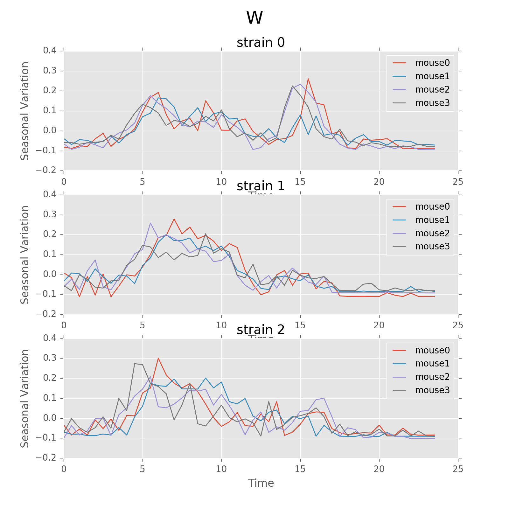
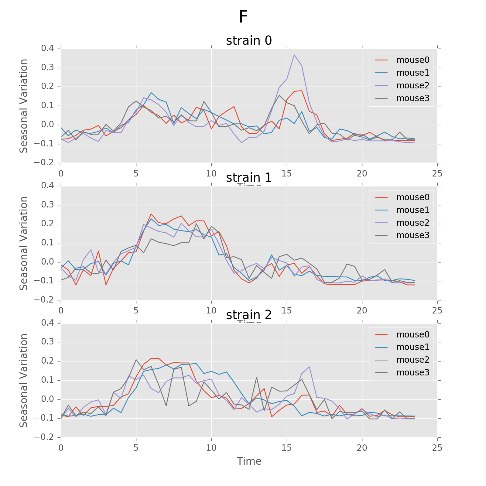
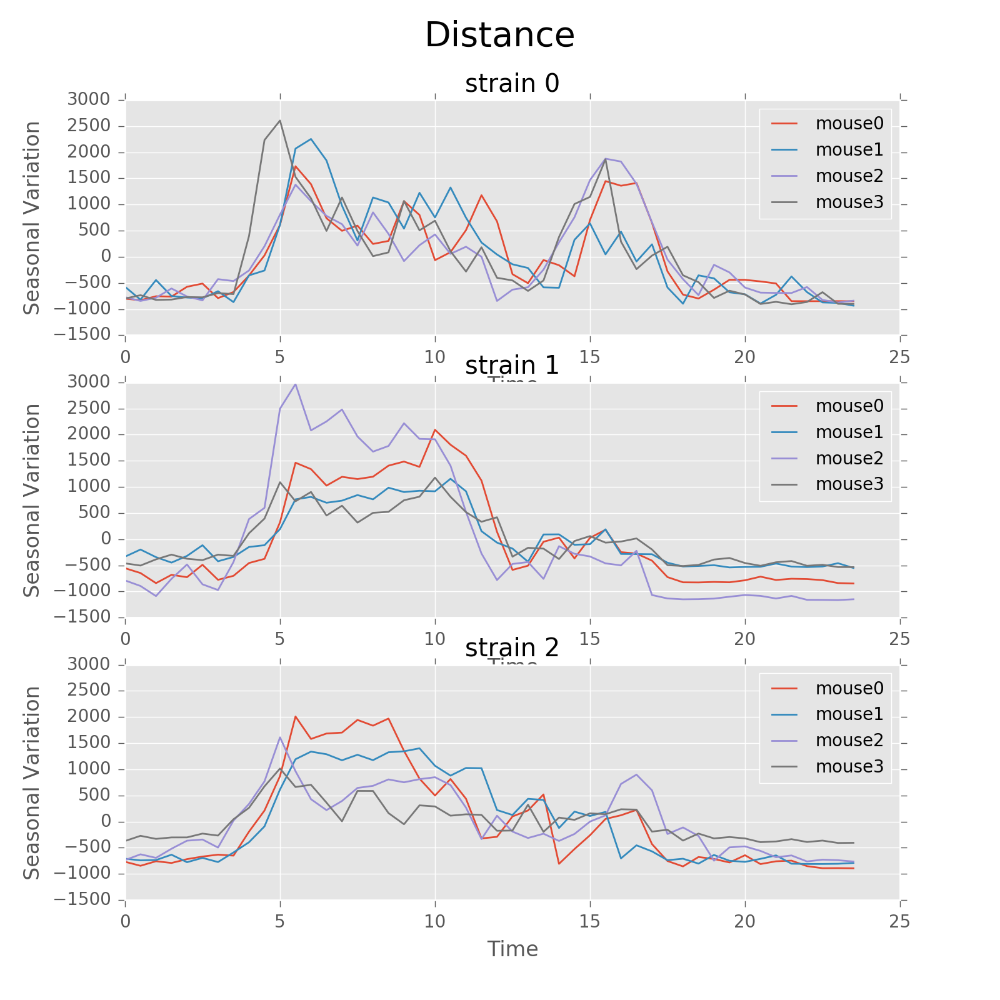
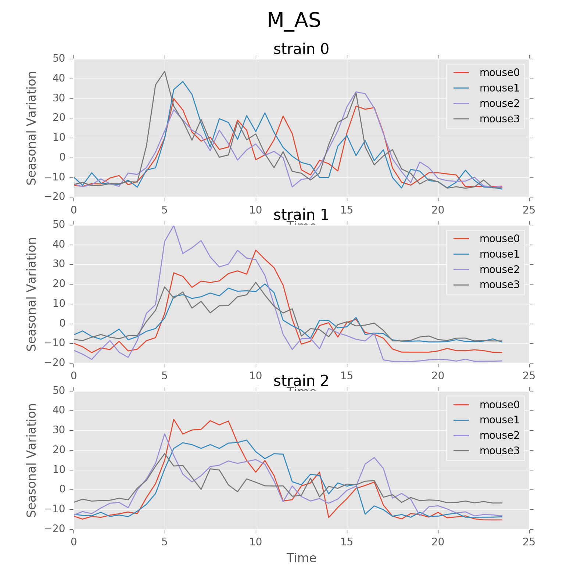
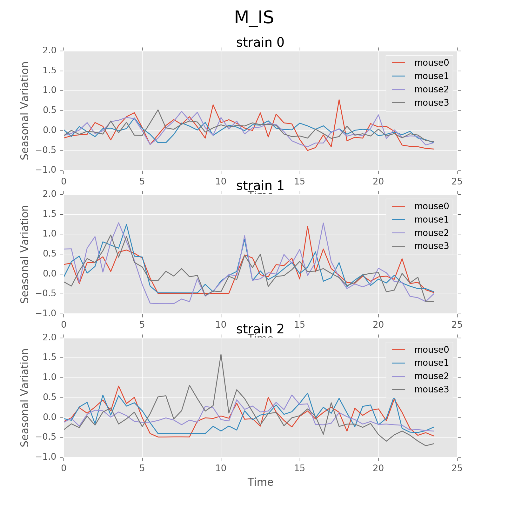
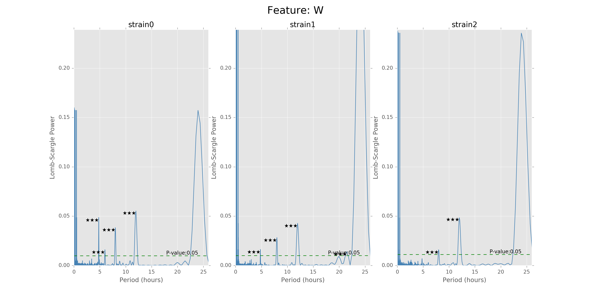
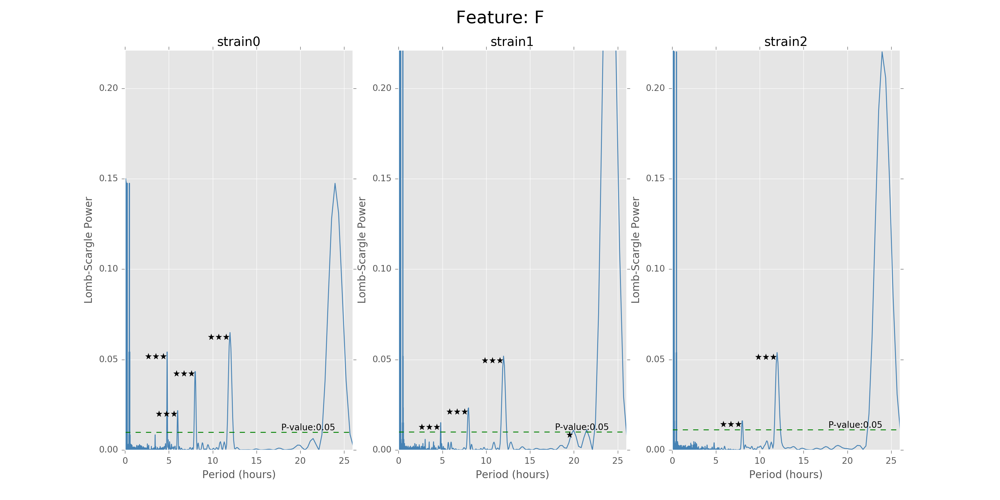
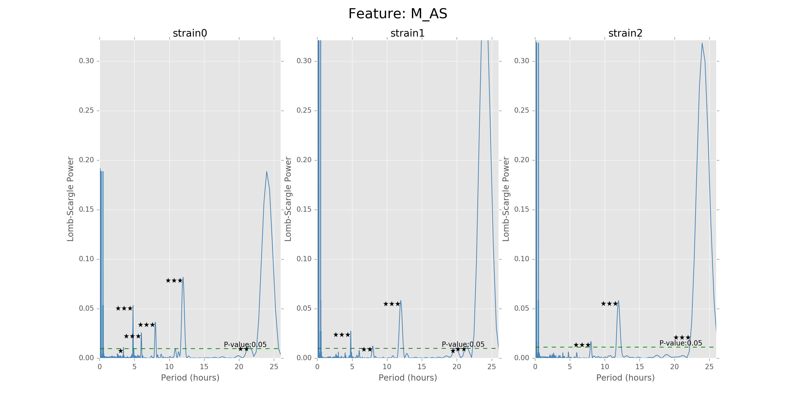
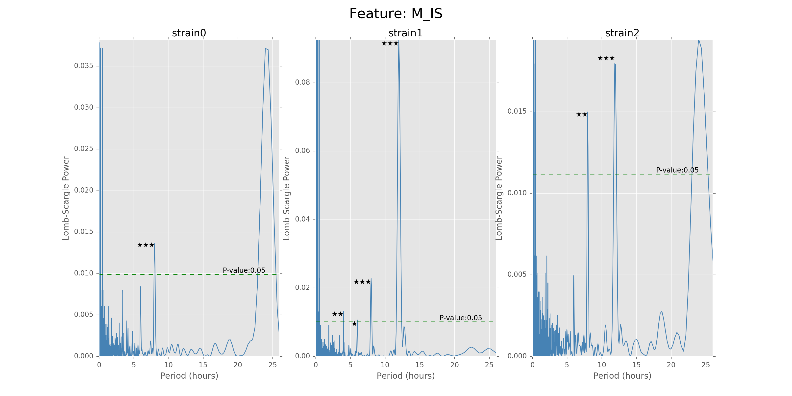

.. _ultradian:

Ultradian and Circadian Analysis
================================

Statement of problem
--------------------

Ultradian and circadian rhythm are widely observed in mammalian
behavioral patterns. The ultradian analysis aims to
find the time-specific patterns in behavioral
records, without specifying the length of the cycle in advance (but need to be
within 1 hour to 1 day). The typical ultradian period includes 8 and 12 hours.
The circadian rhythm refers to a roughly 24-hour cycle.
For example, we expect the rats to be inactive in the nighttime
and ingestions and movements mostly happened in the daytime.

The variables of interests are the summary statistics of mouse activity
including food (F) and water (W) ingestion, distance traveled (D), Active
State probability (AS), movement inside the home base (M_IS) and
movement outside the home base (M_AS). We may also consider spatial variables,
for example, we can spatially discretize the data to cells containing the primary
functions, like a food cell or a water cell, and examine the
ultradian cycle of the spatial probability densities
of the occupancy time in each cell.

In this report, we assume strain to be the primary influence on the variation of
ultradian rhythms across individual mice and examine the
difference in rhythms across strains. Currently, we lack
basic information such as weight, age, and gender. With more data available
in the future, we may look into the cycle for each mouse and detect the most
important factors influencing the ultradian rhythms.

The ultradian and circadian analysis is closely related to other subprojects.
Ultradian rhythms could be treated as one feature for clustering the 16
strains. We may also subset the data using the results of the cluster and
analyze the rhythm similarities and differences across clusters.

Statement of statistical problem
--------------------------------

Our statistical problems are three parts: data preparation, choice of
the frequency or period, and modeling of rhythm patterns.

- Data preparation:

  Mouse behaviors are recorded based on time intervals
  or time points, like the beginning and ending time
  stamp of one food ingestion or the coordinates of mouse
  position at a particular time point. We aggregate the
  data based on given time bins and thus convert the raw data to time series.
  Then how to determine the optimal bin intervals for
  constructing the time series? Bin interval examples include
  5 min, 30 min, 1 hour, etc.

- Choice of the frequency or period:

  For ultradian rhythms, the significant period length may vary according to the
  variables of interests. The Lomb-Scargle (LS) periodogram spectral
  analysis technique, a widely used tool in period detection and frequency
  analysis, is applied.

- Modeling of rhythm patterns:

  We are not only interested in the period length of circadian and
  ultradian rhythms, but also the variation of features over time within the
  discovered circles. To model the time trajectory of features, we propose
  to use seasonal decomposition and mixed effects model.

Data Requirements
-----------------

In order to retrieve the data needed for analyzing mouse ultradian behaviors, we
get input from users, including features (water, food, active state, etc.),
strain number, mouse number and time bin width. Also, we have another function
called “aggregate movements” to track mice’s movements intensity based on time
bins. They enable us to specify which mouse and which kind of features to study.
After getting bin width from users, we allocate the time used by each feature
into selected time intervals. For example, if “30 minutes” is selected to be
bin width and “food” is selected to be the feature, then the eating time intervals
are separated are relocated into 30-minute long bins. For one mouse day, using
30-minute time bin gives 48 records as a result in total.

For eating and drinking behavior, instead of using time consumption as intensity,
we choose to use food or water consumption amount by acquiring food/water
consuming data, and assuming the food/water expended during feeding is
proportional to the time used. For calculating the movements data, we figured
out the position change by generating Euclidean distances first and then
distributing them into different time bins.

The output is a pandas time series, with time index representing time
intervals and values including feature data (such as food/water consumption,
active state time as well as movement distance).

- Input:
  records for each strain (total of 16), each feature of interest (food,
  water, distance, active\_state probability, ...), in a duration of 12 days
  (excluding 4 acclimation days).

- Processed:
  using one-minute time bins of movement records to binary score the
  activity into 0 (IS: inactive state) and 1 (AS: active state); using
  thirty-minute bins of food records to calculate the amount of chows consumed by
  mice; using LS periodogram technique to select the appropriate time bins for
  above.

- Output:
  different patterned visualization for each feature, with the
  appropriate time bins that present the most significant ultradian pattern.

Methodology/Approach Description
--------------------------------

**********************
Seasonal decomposition
**********************

Seasonal decomposition is a very common method used in
time series analysis. One of the main objectives for a decomposition is to
estimate seasonal effects that can be used to create and present seasonally
adjusted values.

Two basic structures are commonly used::

    1. Additive:  x_t = Trend + Seasonal + Random

    2. Multiplicative:  x_t= Trend * Seasonal * Random

The "Random" term is often called "Irregular" in software for decompositions.

Basic steps::

    1. Estimate the trend

    2. "De-trend" the data

    3. Estimate seasonal factors by using the "de-trended" series

    4. Determine the "random" term

The following plot shows the seasonal variation of AS using circadian
period. The difference between strains in rhythm patterns is evident.

Seasonal variation of AS probability (circadian, 24 hours). There appear to be
significant patterns within each group. Strain0 tend to have two active stages
every day, while strain1 will only have one active stage that lasts about
5 hours. The pattern in strain3 is not as strong as other strains, for that
different mice seem to have larger variations. Nevertheless, the behavior with
periods of 24 hours can be more regularly distributed than other periods showed
below.

.. plot:: report/plots/plot_24H_seasonal_AS.py

************************
Lomb-Scargle Period Test
************************

Similar to Fourier analysis, the Lomb-Scargle periodogram is a common tool in
the frequency analysis of unequally spaced data equivalent to least-squares
fitting of sine waves. Basically, we want to fit sine waves of the form:

.. math::

   y=a\cos\omega t+b\sin\omega t

While standard fitting procedures require the solution of a set of linear
equations for each sampled frequency, the Lomb-Scargle method provides an
analytic solution and is therefore both convenient to use and efficient. In this
case, we want to test whether each mouse/strain has a significant cycle less
than 24 hours.

For the mouse behavior data, we use Lomb-Scargle method on different strain
and mouse's data to find the best possible periods with highest p-values.
The function can be used on specific strains and specific mice, as well as
just certain strains without specifying mouse number. We use the $O(N\log N)$
fast implementation of Lomb-Scargle from the gatspy package, but the LS power
around $0$ period is a little bit noisy. The other algorithm can give smooth results
around $0$ point but suffer $O(N^2)$ time complexity. Also, we need to add small uniformly
distributed noise on the regularly sampled time sequence to avoid singular matrix
problems.

The function can give the LS power as well as the P values for the corresponding periods,
with respect to the time bins chosen to combine the data. There will also be stars and
horizontal lines indicating the p-values of significance. Three stars
will be p-values in [0,0.001], two stars will be p-values in
[0.001,0.01], one star will be p-values in [0.01,0.05]. The horizontal
line is the LS power that has p-value of 0.05.

Below are the ultradian analysis results found by combining seasonal decomposition
with best periods returned by Lomb Scargle periodogram. Here we use features "AS"
(active state probability) and "M_IS" (movement time inside home base) as two examples,
because other features like food, water, movement distance, movement time outside
home base all have similar LS plot to "AS" and we show them in Appendix. "M_IS"
shows a rather different pattern.

.. plot:: report/plots/plot_LSSeasonal.py

   The ultradian analysis: seasonal decomposition using best periods returned by
   Lomb Scargle periodogram. For "AS" feature (active state probability), 12 hours
   is the common significant periods for all 3 strains (with p values smaller
   than 0.001). For "M_IS" feature (movement time inside home base), 8 hours
   appears to be the common significant periods for all 3 strains (with p values
   smaller than 0.01). There are certain kinds of consistent patterns within each
   strain. However, the signals are not as strong as in circadian ones (24 hours)
   shown in Seasonal decomposition and Appendix parts.

**************************
Longitudinal data analysis
**************************

-  Attempts for mixed models

   The mixed model is frequently used for longitudinal analysis. We should
   specify the random effects and fixed effects first. Since it is ultradian
   analysis, we only need to focus on the hour factor and their cycle which
   we can get from the previous LS test. The random effect is the mouse id.
   We have four different mice in one strain and only want to compare the
   different patterns among these three strains. So if we set the random
   effect to be mouse id, the effects from different mouses will be
   cancelled out and we can also test the significance of these effects.
   The response variable will be one of the six features listed before.
   After that we can use the mixed model to get the pattern of the
   movements in different time period.

- Build the model

  Take `Food` feature as an example. Here strain0 is a dummy variable
  indicating whether the mouse belongs to strain 0 or not and similarly
  for strain1. strain0hour and strain1hour indicate the interaction
  terms, which we add in order to figure out whether the strain and
  hour have some interaction effect in the Food feature.(`i denote ith
  strain, j denote the jth mouse`)

.. math::

  Food_{ij} = f(strain0_{ij} , strain1_{ij} , hour_{ij} , cycle_{ij}) + interactions + \beta_j mouse

- Perform significance test

  Here we have two purposes. The first is to figure out if the effects from
  different mouses are significant. The second is to figure out if the
  patterns for different strains are significantly different. To test the
  first one, we just need to use the t-test and get the p-value from the
  result by using the `statsmodels.formula.api` package. package. For the
  second one, we can perform the likelihood ratio test on the interaction terms.

First, we look at the summary of the full model (also take the Food feature
as an example). To get this result, we fit the second-degree function. Since
the cycles from the previous study are very similar between strains, we did
not include it here. We can see that the effects of the mouse from the same
strain are not significant. However, the p-value here seems to indicate that
the interaction terms is not as significant as the other factors. So we
consider conducting the likelihood ratio test.

=============  =======  ===========  ========  ======
factors        Coef.     Std.Err.       z       P>|z|
=============  =======  ===========  ========  ======
Intercept      0.049     0.008        6.095     0.000
hour           -0.005    0.001        14.961    0.000
hour2          -0.001    0.000        -18.767   0.000
strain0        -0.027    0.010        -2.624    0.009
strain1        0.045     0.010        4.332     0.000
strain0:hour   -0.002    0.002        -0.778    0.437
strain1:hour   -0.004    0.000        -1.76     0.078
strain0:hour2  0.000     0.000         2.019    0.043
strain1:hour2  0.000     0.000         0.540    0.589
RE             0.000     0.000
=============  =======  ===========  ========  ======

Secondly we did likelihood ratio test between the two models: full model and
reduced interaction terms model. We found that the p values for 6 features below:

=======  ========  ========  =======  ========  ========
Water    Food      AS        M_AS     M_IS      Distance
=======  ========  ========  =======  ========  ========
3.08e-9  2.50e-9   9.39e-12  5.11e-5  0.002     1.53e-8
=======  ========  ========  =======  ========  ========

We can see that the Water, Food, AS, M_AS, Distance have significantly different
patterns of different strains.

Testing Framework Outline
-------------------------

Step 1: Generating random samples for testing:

- Split the data based on the Mouse Day Cycle
- Number the splits and use numpy.random to subset from these splits

Step 2: Conduct Lomb-Scargle (LS) test to detect the period. Implement the
three different models onto the certain period and get the patterns/ estimated
coefficients for the model.

Step 3: Compare the result with our hypothesis.

Appendix
--------

   Seasonal variation of other features (circadian). Strain0 and strain1 have
   more obvious patterns than strain3, which is consistent with the findings in
   longitudinal data analysis.

   Seasonal variation of other features (circadian).

   Seasonal variation of other features (circadian).

   Seasonal variation of other features (circadian).

   Seasonal variation of other features (circadian). Strain0 and strain1 have
   more obvious patterns than strain3, which is consistent with the findings in
   longitudinal data analysis.

   Lomb scargle plot for different features. Different strains have different
   ultradian periods, differing also in p-values. Here $O(N\log N)$
   algorithms suffer an instability around 0 points while $O(N^2)$
   algorithms can be more smooth. We here compare the significant ultradian
   periods between strains and ignore the highest LS power appearing near
   24 hours.

   Lomb scargle plot for different features. Different strains have different
   ultradian periods, differing also in p-values. Here $O(N\log N)$
   algorithms suffer an instability around 0 points while $O(N^2)$
   algorithms can be more smooth. We here compare the significant ultradian
   periods between strains and ignore the highest LS power appearing near
   24 hours.
